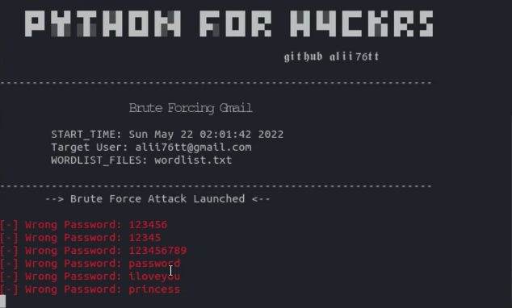

<h1 align='center'>Python Gmail Brute Force Attack</h1>
<p align='center'>Brute force attack on gmail written in python. This process will take a long time depending on the length of the password.</p>
<p align='center'>Note: The target must have 'Less secure app access' turned on.</p>

<p align='center'>
    
</p>


## Requirements
You can install the Requirements by running the command:

```
pip install colorama==0.4.4
```

## How to use?
```sh
$ pip install colorama==0.4.4
$ python main.py -u <user@gmail.com> -w <wordlist>
```
## YouTube Video
[](https://youtu.be/NGFVGfRGlw8 "Python Gmail Brute Force Attack")
