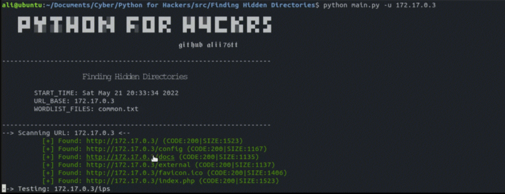

<h1 align='center'>Python Finding Hidden Dİrectories</h1>
<p align='center'>Simple script to show hidden directories written in Python.</p>

<p align='center'>
    
</p>


## Requirements
You can install the Requirements by running the command:

```
pip install colorama==0.4.4
```

## How to use?
```sh
$ pip install colorama==0.4.4
$ python main.py -u test.com -w <wordlist>
```
## YouTube Video
[](https://www.youtube.com/watch?v=aZBXqQoo8Mo "Python Finding Hidden Dİrectories
")