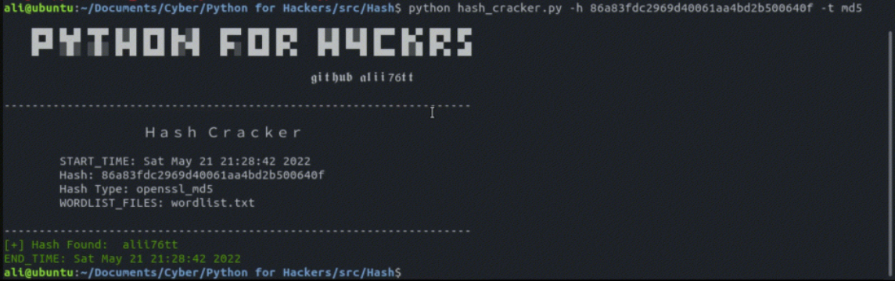

<h1 align='center'>Python Hash Cracker</h1>
<p align='center'>Decodes supported hashes written in Python.</p>
<p align='center'>Supported Formats: 'md5', 'sha1', 'sha224', 'sha256', 'sha384', 'sha512'</p>

<p align='center'>
    
</p>


## Requirements
You can install the Requirements by running the command:

```
pip install colorama==0.4.4
```

## How to use?
```sh
$ pip install colorama==0.4.4
$ python main.py -h <hash> -t <type> -w <wordlist>
```
## YouTube Video
[](https://youtu.be/AIKtfYaIdaw "Python Hash Cracker
")