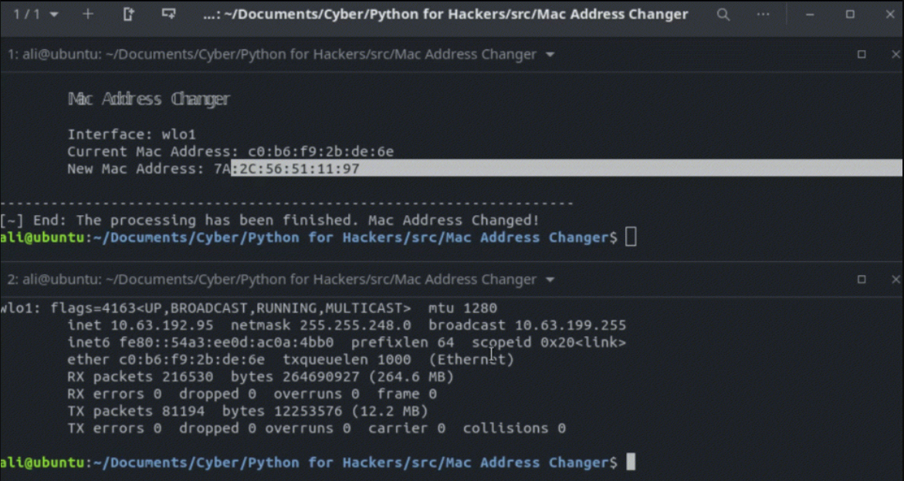

<h1 align='center'>Python Mac Address Changer</h1>
<p align='center'>
    
</p>


## How to use?
```sh
$ python main.py -i <interface> -m <new_mac>
```
## YouTube Video
[](https://youtu.be/kLj_YBfa30M "Python Mac Address Changer
")